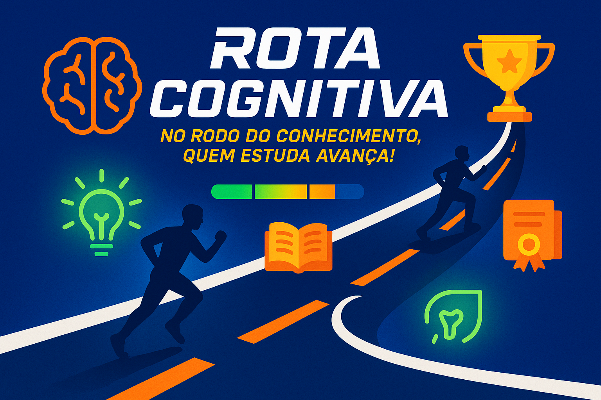

# Rota Cognitiva :brain: :trophy: :checkered_flag:
Este projeto tem como objetivo praticar os conhecimentos adquiridos nos estudaos de *Domain Driven Design*. 

## Contexto :memo:
Esse projeto tem como propósito a gamificação de planos de carreira, atomizando as metas e incentivando competitividade de forma similar ao *GymRats* 🐭.

## Bounded Contexts

| **Contexto**     | **Responsabilidade**                                                              | **Entidades Principais**           | **Depende de**          | **Tipo de Dependência**            |
| ---------------- | --------------------------------------------------------------------------------- | ---------------------------------- | ----------------------- | ---------------------------------- |
| **User**         | Gerenciar contas de usuários, autenticação e perfil                               | `User`                             | —                       | Upstream                           |
| **Group**        | Criar e gerenciar grupos, vincular usuários                                       | `Group`, `UserGroup`               | `User`                  | Downstream do User                 |
| **Study**        | Registrar conteúdos e sessões de estudo                                           | `Content`, `StudySession`          | `User`                  | Downstream do User                 |
| **Goal**         | Definir metas (diárias ou semanais), acompanhar e calcular multiplicadores        | `Goal`                             | `User`, `Content`       | Downstream do Study                |
| **Gamification** | Lógica de streaks, cálculo de XP, seasons e multiplicadores                       | `Streak`, `Season`                 | `Study`, `Goal`         | Downstream do Study e Goal         |
| **Progress**     | Registrar conquistas baseadas na performance em seasons                           | `Achievement`                      | `Gamification`          | Downstream do Gamification         |
| **Visibility**   | Mostrar o progresso do usuário ao grupo durante uma season (ranking, comparações) | `GroupSeasonView` (visão derivada) | `Group`, `Gamification` | Downstream de Group e Gamification |

